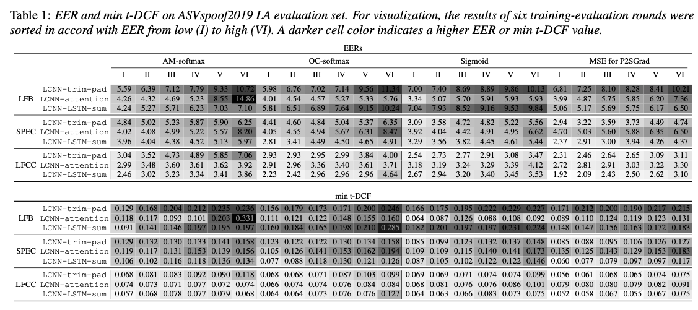
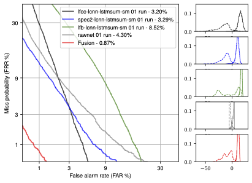

# Welcome 

This is a set of Python / Pytorch scripts and tools for various speech processing projects. 

It is maintained by [Xin Wang](http://tonywangx.github.io/) since 2021.  

XW is a Pytorch beginner. Please feel free to give suggestions and feedback.

## Notes


* The repo is relatively large. Please use `--depth 1` option for fast cloning.

```sh
git clone --depth 1 https://github.com/nii-yamagishilab/project-NN-Pytorch-scripts.git
```

* Latest updates:

   Pointer to tutorials on neural vocoders were moved to [./tutorials/b1_neural_vocoder](./tutorials/b1_neural_vocoder/README.md).
   
   All pre-trained models were moved to [Zenodo](https://doi.org/10.5281/zenodo.6349636).

## Table of Contents

* [Overview](#overview)
* [Requirements](#env)
* [How to use](#use)
* [Project design](#conv)


<a name="overview"></a>
## Overview
This repository hosts the following projects:

<a name="overview2-1"></a>
### Neural source-filter waveform model 
[./project/01-nsf](./project/01-nsf)

Models available: 

1. [Cyclic-noise neural source-filter waveform model (NSF)](https://nii-yamagishilab.github.io/samples-nsf/nsf-v4.html)

2. [Harmonic-plus-noise NSF with trainable sinc filter (Hn-sinc-NSF)](https://nii-yamagishilab.github.io/samples-nsf/nsf-v3.html) 

3. [Harmonic-plus-noise NSF with fixed FIR filter (Hn-NSF)](https://nii-yamagishilab.github.io/samples-nsf/nsf-v2.html) 

4. Hn-sinc-NSF + [HiFiGAN discriminator](https://github.com/jik876/hifi-gan)

All the projects include a pre-trained model on CMU-arctic database (4 speakers) and a demo script to run, train, do inference. Please check [./project/01-nsf/README](./project/01-nsf/README).


Tutorial on NSF models is also available in [./tutorials/b1_neural_vocoder](./tutorials/b1_neural_vocoder).


Many samples can be found on [NSF homepage](https://nii-yamagishilab.github.io/samples-nsf/). Also reference papers.


<a name="overview2-2"></a>
### Other neural waveform models 
[./project/05-nn-vocoders](./project/05-nn-vocoders)

Models available:

1. [WaveNet vocoder](https://deepmind.com/blog/wavenet-generative-model-raw-audio/)

2. [WaveGlow](https://ieeexplore.ieee.org/document/8683143)

3. [Blow](https://blowconversions.github.io/)

4. [iLPCNet](https://arxiv.org/pdf/2001.11686.pdf)

All the projects include a pre-trained model and a one-click demo script. Please check [./project/05-nn-vocoders/README](./project/05-nn-vocoders/README).

Tutorial on NSF models is also available in [./tutorials/b1_neural_vocoder](./tutorials/b1_neural_vocoder).

<a name="overview2-3"></a>
### ASVspoof project with a toy data set
[./project/04-asvspoof2021-toy](./project/04-asvspoof2021-toy)

It takes time to download ASVspoof2019 database. 

This project demonstrates how to train and evaluate the anti-spoofing model using a toy dataset.

Please check [./project/04-asvspoof2021-toy/README](./project/04-asvspoof2021-toy/README).


<a name="overview2-4"></a>
### Speech anti-spoofing for ASVspoof 2019 LA 
[./project/03-asvspoof-mega](./project/03-asvspoof-mega)

This is for Interspeech paper ([Link](https://www.isca-speech.org/archive/interspeech_2021/wang21fa_interspeech.html)) and a new book chapter ([Link]((https://arxiv.org/abs/2201.03321)))

```sh
Xin Wang, and Junichi Yamagishi. A Comparative Study on Recent Neural Spoofing Countermeasures for Synthetic Speech Detection. In Proc. Interspeech, 4259–4263. doi:10.21437/Interspeech.2021-702. 2021.

Xin Wang, and Junichi Yamagishi. A Practical Guide to Logical Access Voice Presentation Attack Detection. In Frontiers in Fake Media Generation and Detection, 169–214. doi:10.1007/978-981-19-1524-6_8. 2022.
```

There were 36 systems investigated, each of which was trained and evaluated for 6 rounds with different random seeds.





Pre-trained models, scores, training recipes are all available. Please check [./project/03-asvspoof-mega/README](./project/03-asvspoof-mega/README).


For LCNN, please check [this paper](https://www.isca-speech.org/archive/Interspeech_2019/abstracts/1768.html); for LFCC, please check [this paper](https://www.isca-speech.org/archive/interspeech_2015/i15_2087.html); for one-class softmax in ASVspoof, please check [this paper](https://arxiv.org/pdf/2010.13995).

For statistical analysis, please check this tutorial notebook in [./tutorials/b2_anti_spoofing](./tutorials/b2_anti_spoofing/chapter_a1_stats_test.ipynb)

<a name="overview2-5"></a>
### Speech anti-spoofing with confidence estimation
[./project/06-asvspoof-ood](./project/06-asvspoof-ood)

Project for ICASSP paper
```
Xin Wang, and Junichi Yamagishi. Estimating the Confidence of Speech Spoofing Countermeasure. In Proc. ICASSP, 6372–6376. 2022.
```

Pre-trained models and recipes are all available. Please check [./project/06-asvspoof-ood/README](./project/06-asvspoof-ood/README).


<a name="overview2-6"></a>
### Speech anti-spoofing with SSL front end
[./project/07-asvspoof-ssl](./project/07-asvspoof-ssl)

Project for Odyssey paper ([Link](https://www.isca-speech.org/archive/odyssey_2022/wang22_odyssey.html))
```
Xin Wang, and Junichi Yamagishi. Investigating Self-Supervised Front Ends for Speech Spoofing Countermeasures. In Proc. Odyssey, 100–106. ISCA: ISCA. doi:10.21437/Odyssey.2022-14. 2022.
```

Pre-trained models, recipes are all available. Please check [./project/07-asvspoof-ssl/README](./project/07-asvspoof-ssl/README).

**Note that** this project requires a specific version of [fairseq](https://github.com/pytorch/fairseq/) and uses [env-fs-install.sh](env-fs-install.sh) to install the dependency. For convenience, the demonstration script [./project/07-asvspoof-ssl/00_demo.sh](./project/07-asvspoof-ssl/00_demo.sh) will call the shell script and install the dependency automatically. Just go there and run 00_demo.sh.


------
<a name="env"></a>
## Python environment

Projects above use either one of the two environments:

### For most of the projects above
You may use [./env.yml](./env.yml) to create the environment: 

```sh
# create environment
conda env create -f env.yml

# load environment (whose name is pytorch-1.6)
conda activate pytorch-1.6
```

### For Speech anti-spoofing with SSL front end
You may use [./env-fs-install.sh](./env-fs-install.sh) to install the depenency.

```sh
# make sure other conda envs are not loaded
bash env-fs-install.sh

# load
conda activate fairseq-pip2
```

------
<a name="use"></a>
## How to use

Please check README in each project.

In many cases, simply run 00_demo.sh with proper arguments is sufficient. 

Take `project/01-nsf/cyc-noise-nsf` as an example:

```sh
# cd into one project
cd project/01-nsf/cyc-noise-nsf-4

# add PYTHONPATH and activate conda environment
source ../../../env.sh 

# run the script
bash 00_demo.sh
```

The printed info will show what is happening. The script may need 1 day or more to finish.

You may also put the job to the background rather than waiting for the job in front of the terminal:

```sh
# run the script in background
bash 00_demo.sh > log_batch 2>&1 &
```

The above steps will download the CMU-arctic data, run waveform generation using a pre-trained model, and train a new model. 

------
<a name="conv"></a>
## Project design and convention

### Data format

* Waveform: 16/32-bit PCM or 32-bit float WAV that can be read by [scipy.io.wavfile.read](https://docs.scipy.org/doc/scipy/reference/generated/scipy.io.wavfile.read.html) 

* Other data: binary, float-32bit, little endian ([numpy dtype <f4](https://numpy.org/doc/1.18/reference/generated/numpy.dtype.html)). The data can be read in python by:

```python
# for a data of shape [N, M]
f = open(filepath,'rb')
datatype = np.dtype(('<f4',(M,)))
data = np.fromfile(f,dtype=datatype)
f.close()
```

I assume data should be stored in [c_continuous format](https://numpy.org/doc/stable/reference/generated/numpy.ndarray.flags.html) (row-major). 
There are helper functions in ./core_scripts/data_io/io_tools.py to read and write binary data:

```python
# create a float32 data array
import numpy as np
data = np.asarray(np.random.randn(5, 3), dtype=np.float32)

# write to './temp.bin' and read it as data2
import core_scripts.data_io.io_tools as readwrite
readwrite.f_write_raw_mat(data, './temp.bin')
data2 = readwrite.f_read_raw_mat('./temp.bin', 3)

# result should 0
data - data2
```

More instructions can be found in the Jupyter notebook [here](https://colab.research.google.com/drive/1EO-ggi1U9f2zXwTiqg7AEljVx11JKta7?usp=sharing).


### Files in this repository

Name | Function
------------ | -------------
./core_scripts | scripts (Numpy or Pytorch code) to manage the training process, data io, etc.
./core_modules | finalized pytorch modules 
./sandbox | new functions and modules to be test
./project | project directories, and each folder correspond to one model for one dataset
./project/\*/\*/main.py | script to load data and run training and inference
./project/\*/\*/model.py | model definition based on Pytorch APIs
./project/\*/\*/config.py | configurations for training/val/test set data

The motivation is to separate the training and inference process, the model definition, and the data configuration. For example:

* To define a new model, change model.py

* To run on a new database, change config.py

The separation is not always strictly followed. 

### How the script works

The script starts with main.py and calls different functions for model training and inference. 

```sh
During training:

     <main.py>        Entry point and controller of training process
        |           
   Argument parse     core_scripts/config_parse/arg_parse.py
   Initialization     core_scripts/startup_config.py
   Choose device     
        | 
Initialize & load     core_scripts/data_io/customize_dataset.py
training data set
        |----------|
        .     Load data set   <config.py> 
        .     configuration 
        .          |
        .     Loop over       core_scripts/data_io/customize_dataset.py
        .     data subset
        .          |       
        .          |---------|
        .          .    Load one subset   core_scripts/data_io/default_data_io.py
        .          .         |
        .          |---------|
        .          |
        .     Combine subsets 
        .     into one set
        .          |
        |----------|
        |
Initialize & load 
development data set  
        |
Initialize Model     <model.py>
Model(), Loss()
        | 
Initialize Optimizer core_scripts/op_manager/op_manager.py
        |
Load checkpoint      --trained-model option to main.py
        |
Start training       core_scripts/nn_manager/nn_manager.py f_train_wrapper()
        |             
        |----------|
        .          |
        .     Loop over training data
        .     for one epoch
        .          |
        .          |-------|    core_scripts/nn_manager/nn_manager.py f_run_one_epoch()
        .          |       |    
        .          |  Loop over 
        .          |  training data
        .          |       |
        .          |       |-------|
        .          |       .    get data_in, data_tar, data_info
        .          |       .    Call data_gen <- Model.forward(...)   <mode.py>
        .          |       .    Call Loss.compute()                   <mode.py>
        .          |       .    loss.backward()
        .          |       .    optimizer.step()
        .          |       .       |
        .          |       |-------|
        .          |       |
        .          |  Save checkpoint 
        .          |       |
        .          |  Early stop?
        .          |       | No  \
        .          |       |      \ Yes
        .          |<------|       |
        .                          |
        |--------------------------|
       Done
```

A detailed flowchart is [./misc/APPENDIX_1.md](./misc/APPENDIX_1.md). This may be useful if you want to hack into the code.


## Resources & links

* [NSF model homepage](https://nii-yamagishilab.github.io/samples-nsf/)

* [Presentation slides related to the above projects](http://tonywangx.github.io/slide.html)


---
By [Xin Wang](http://tonywangx.github.io/)